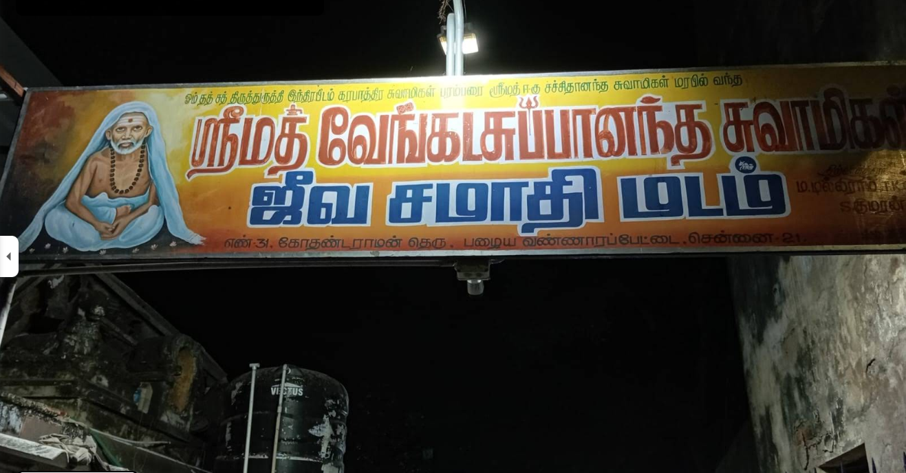
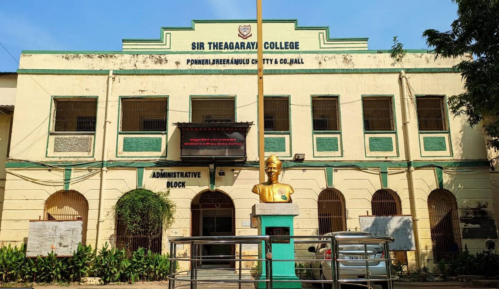
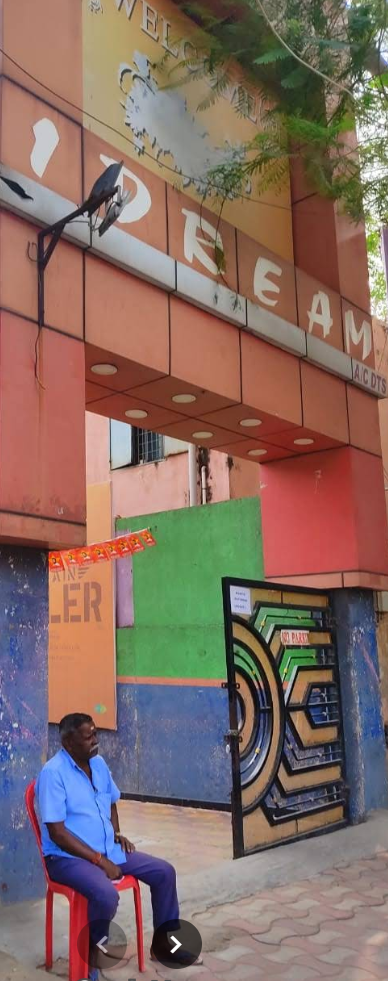
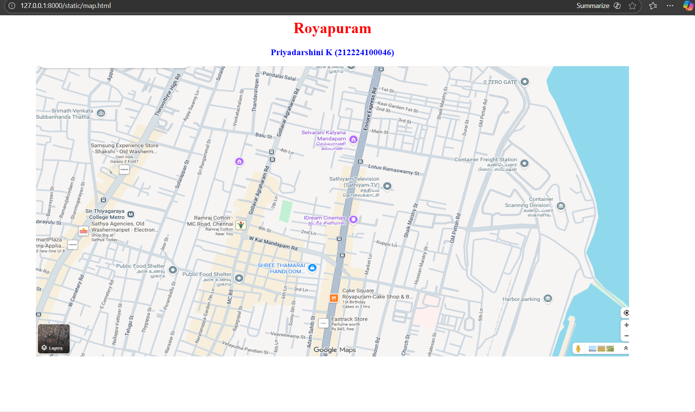
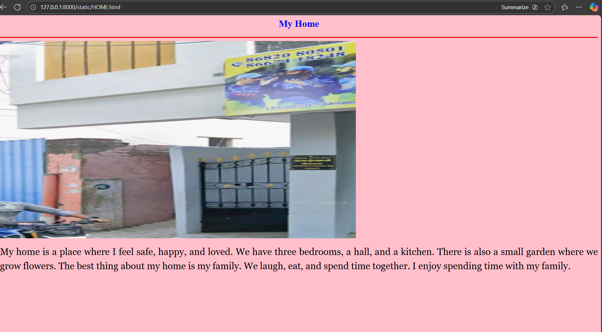
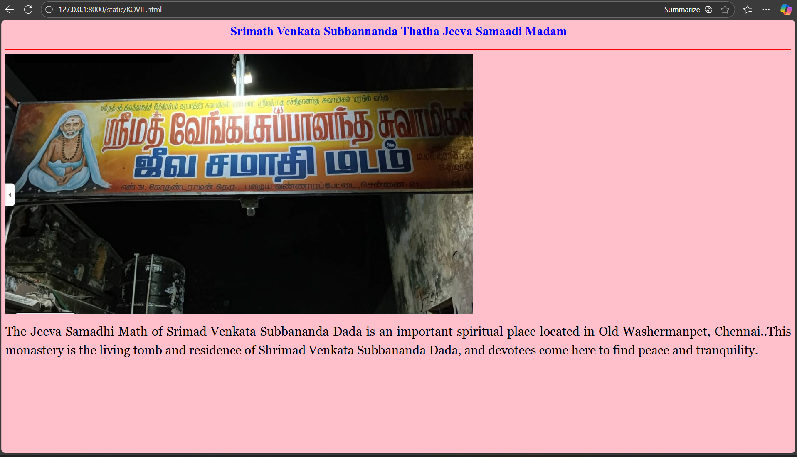
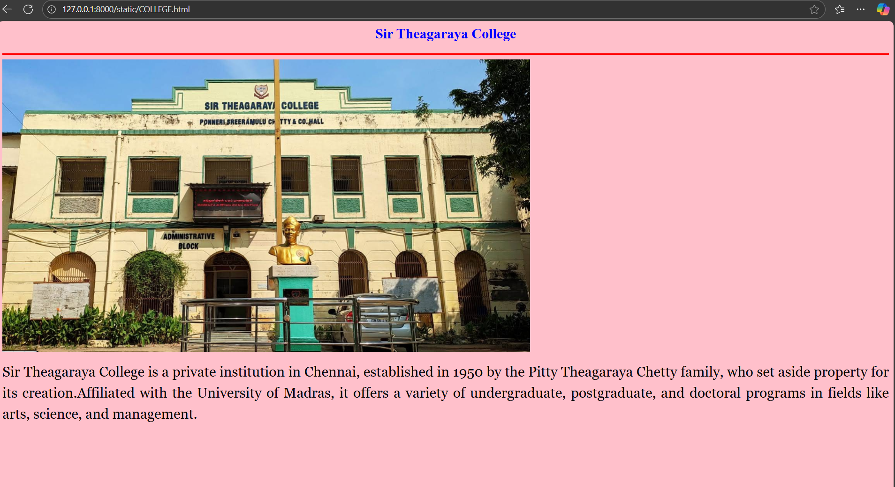
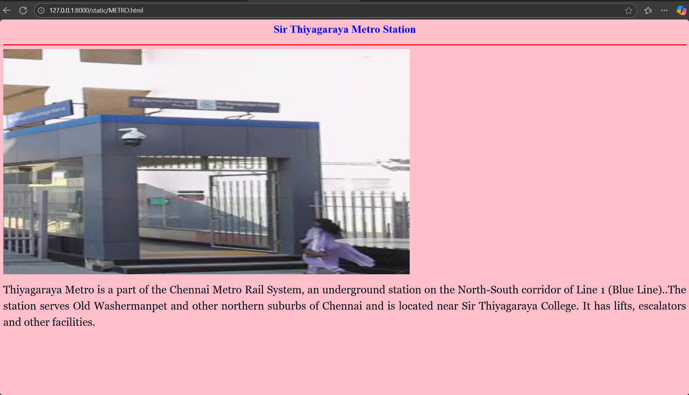
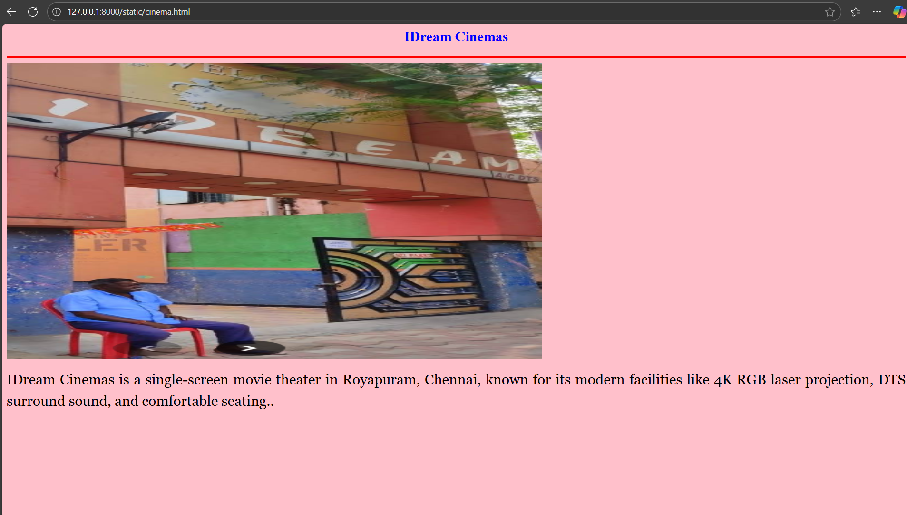

# Ex04 Places Around Me
## Date: 

## AIM
To develop a website to display details about the places around my house.

## DESIGN STEPS

### STEP 1
Create a Django admin interface.

### STEP 2
Download your city map from Google.

### STEP 3
Using ```<map>``` tag name the map.

### STEP 4
Create clickable regions in the image using ```<area>``` tag.

### STEP 5
Write HTML programs for all the regions identified.

### STEP 6
Execute the programs and publish them.

## CODE
MAP.HTML
```
<html>
<head>
    <title>My City</title>
</head>
<body> 
    <h1 align="center"><font color="Red"><b>Royapuram</b></font></h1>
    <h3 align="center"><font color="blue"><b>Priyadarshini K (212224100046)</b></font></h3>
    <center>
        
        <map name="My Home Town">
            <area target="_blank" alt="Sir Theagaraya College" title="Sir Theagaraya College" href="COLLEGE.html" coords="1705,209,1743,234" shape="rect">
            <area target="_blank" alt="Sir Thiyagaraya Metro Station" title="Sir Thiyagaraya Metro Station" href="METRO.html" coords="825,631,870,676" shape="rect">
            <area target="_blank" alt="Srimath Venkata Subbannanda Thatha Jeeva Samaadi Madam" title="Srimath Venkata Subbannanda Thatha Jeeva Samaadi Madam" href="KOVIL.html" coords="172,407,219,449" shape="rect">
            <area target="_blank" alt="My Home" title="My Home" href="HOME.html" coords="1326,433,1359,474" shape="rect">
            <area target="_blank" alt="IDream Cinemas" title="IDream Cinemas" href="cinema.html" coords="1033,4,227,4,221,73,334,93,415,137,520,173,618,195,723,208,821,230,926,220,1011,103" shape="poly">
        </map>
    </center>
</body>
</html>
```
HOME.HTML
```
<html>
    <head>
        <title>My Home Town</title>
    </head>
    <body bgcolor="pink">
        <h2 align="center">
            <font color="blue"><b>My Home</b></font>
        </h2>
        <hr size="3" color="red">
        
        <p align="justify" style="line-height: 1.5;">
            <font face="Georgia" size="5">
                My home is a place where I feel safe, happy, and loved. We have three bedrooms, a hall, and a kitchen. There is also a small garden where we grow flowers.

The best thing about my home is my family. We laugh, eat, and spend time together. I enjoy spending time with my family.
            </font>
        </p>
    </body>
</html>
```
KOVIL.HTML
```
<html>
    <head>
        <title>My Home Town</title>
    </head>
    <body bgcolor="pink">
        <h2 align="center">
            <font color="blue"><b>Srimath Venkata Subbannanda Thatha Jeeva Samaadi Madam</b></font>
        </h2>
        <hr size="3" color="red">
        
        <p align="justify" style="line-height: 1.5;">
            <font face="Georgia" size="5">The Jeeva Samadhi Math of Srimad Venkata Subbananda Dada is an important spiritual place located in Old Washermanpet, Chennai..This monastery is the living tomb and residence of Shrimad Venkata Subbananda Dada, and devotees come here to find peace and tranquility. </p>
    </body>
```
COLLEGE.HTML
```
<html>
    <head>
        <title>
            My Home Town
        </title>
    </head>
    <body bgcolor="pink">
        <h2 align="center">
            <font color="blue"><b>Sir Theagaraya College</b></font>
        </h2>
        <hr size="3" color="red">
        
        <p align="justify" style="line-height: 1.5;">
            <font face="Georgia" size="5"> Sir Theagaraya College is a private institution in Chennai, established in 1950 by the Pitty Theagaraya Chetty family, who set aside property for its creation.Affiliated with the University of Madras, it offers a variety of undergraduate, postgraduate, and doctoral programs in fields like arts, science, and management.  </p>
    </body>
</html> 
```
METRO.HTML
```
<html>
    <head>
        <title>My Home Town</title>
    </head>
    <body bgcolor="pink">
        <h2 align="center">
            <font color="blue"><b>Sir Thiyagaraya Metro Station</b></font>
        </h2>
        <hr size="3" color="red">
        
        <p align="justify" style="line-height: 1.5;">
            <font face="Georgia" size="5">
               Thiyagaraya Metro is a part of the Chennai Metro Rail System, an underground station on the North-South corridor of Line 1 (Blue Line)..The station serves Old Washermanpet and other northern suburbs of Chennai and is located near Sir Thiyagaraya College. It has lifts, escalators and other facilities. </p>
    </body>
</html>
```
CINEMA.HTML
```
<html>
    <head>
        <title>My Home Town</title>
    </head>
    <body bgcolor="pink">
        <h2 align="center">
            <font color="blue"><b>IDream Cinemas</b></font>
        </h2>
        <hr size="3" color="red">
        
        <p align="justify" style="line-height: 1.5;">
            <font face="Georgia" size="5">IDream Cinemas is a single-screen movie theater in Royapuram, Chennai, known for its modern facilities like 4K RGB laser projection, DTS surround sound, and comfortable seating..</p>
    </body>
</html>
```


## OUTPUT








## RESULT
The program for implementing image maps using HTML is executed successfully.
